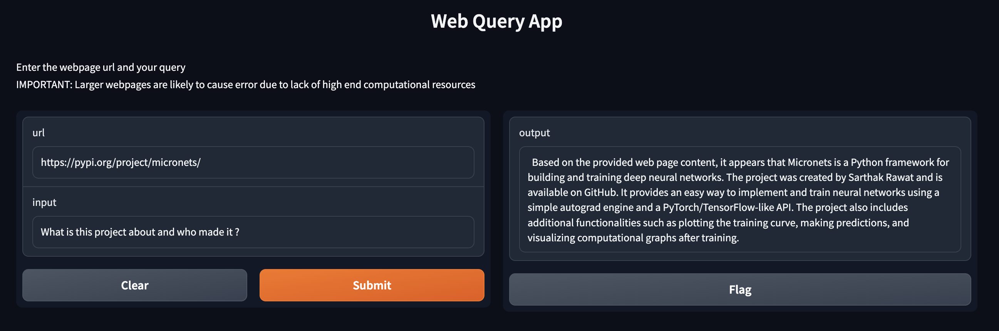

# WebQuery App
WebQuery is a LLM(Large Language Model) application powered by Meta's LLaMA-2 model used to ask questions related to the content of any public webpage present on the internet.

Specifically, this project uses the [TheBloke/Llama-2-7b-Chat-GPTQ](https://huggingface.co/TheBloke/Llama-2-7b-Chat-GPTQ) quantized model from the huggingface hub for better performance on systems with limited GPU RAM and thus also providing faster inferencing.

#### Example :


## Usage

### 1. Colab Notebook (recommended)
<br>
This is the simplest and easiest way to run this project.

1. Locate the `web_query_demo.ipynb` in this repo
2. Click the "Open in Colab" button at the top of the file
3. Change the runtime type to T4 GPU
4. Run all the cells in the notebook

### 2. Run Locally

Inferencing this model locally requires a GPU with atleast 8GB of GPU RAM.

#### Instructions:

1. Clone this repository to your local machine.
```bash
git clone https://github.com/Sarthakrw/web-query.git
```

2. Navigate to project directory.
```bash
cd web-query
```

3. Install the required dependencies. 
```bash
pip install -r requirements.txt
```

4. Run the `app.py` file.
```bash
python app.py
```

5. Open the link provided in the terminal in your browser.

### 3. Huggingface Spaces (not recommended)

The version of this project hosted on huggingface spaces uses the [TheBloke/Llama-2-7B-GGML](https://huggingface.co/TheBloke/Llama-2-7B-GGML) model which is designed to be run on the CPU(as it is the only free computing resource provided).

Unfortunately this model has incredibly slow inference speed(~20-30min per query) and is not recommended for use. But the output quality is still decent.

<br>

#### check it out [here](https://huggingface.co/spaces/sarthakrw/web-query)

<br>


## License

This project is licensed under [Apache 2.0](LICENSE)
